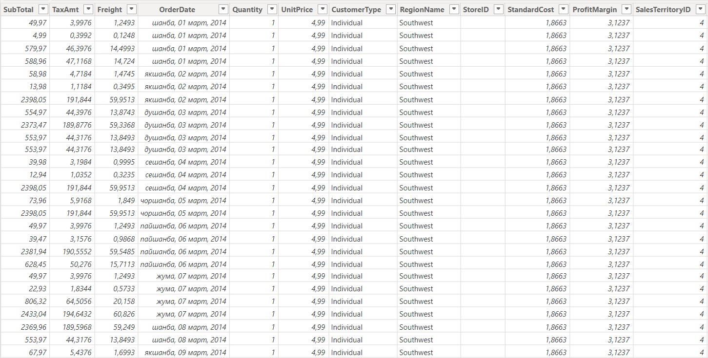
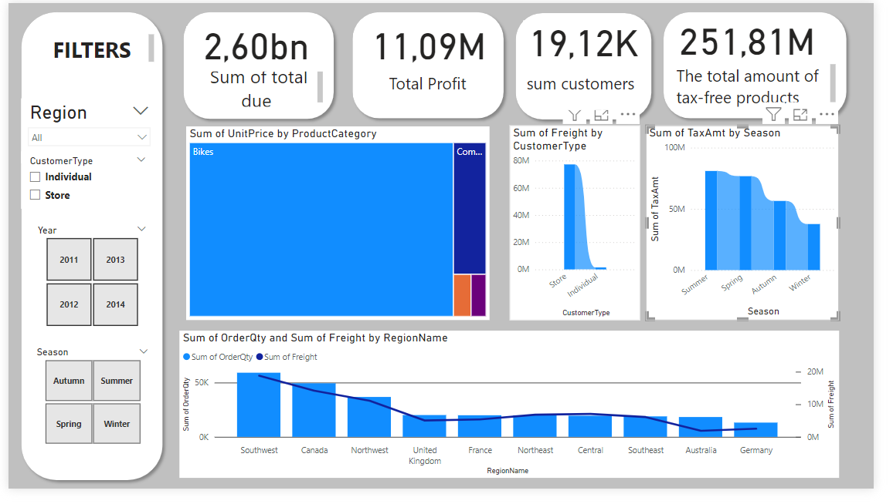
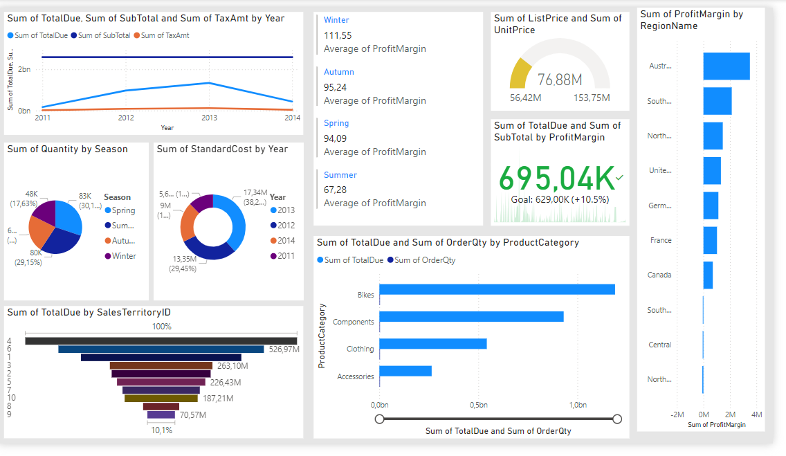
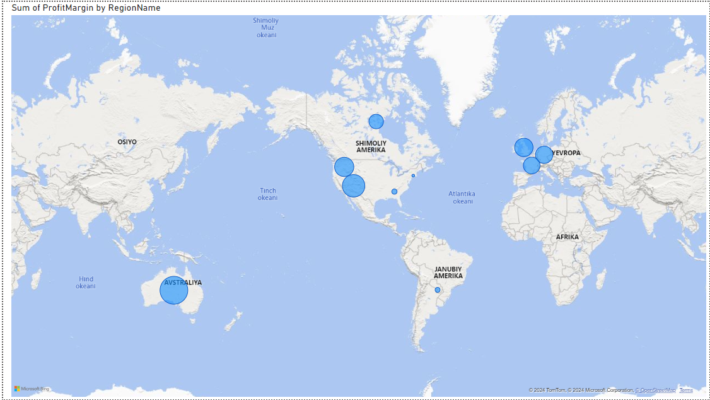

# Sales Dashboard in Power BI - AdventureWorks2022

This dashboard provides key insights into sales data from the AdventureWorks2022 database, allowing for analysis of revenue, profit, customer types, and more. The visualizations are built using various measures and dimensions to help understand business performance.

## Dashboard Overview

The dashboard includes several key metrics and visualizations designed to help track business performance:

- **Total Due (2.60bn)**: Represents the sum of total amounts due from all sales transactions.
- **Total Profit (11.09M)**: Displays the total profit generated by subtracting standard costs from unit prices.
- **Total Customers (19.12K)**: Shows the total number of unique customers.
- **Tax-Free Products (251.81M)**: Total value of products sold that are tax-free.

### Filters:
- **Region**: Filter sales data by different regions.
- **Customer Type**: Filter between individual and store customers.
- **Year**: Allows selection of sales data by year.
- **Season**: Filter sales performance by the season of the year.

## Visualizations

### 1. **Sum of UnitPrice by ProductCategory (Treemap)**
   - Displays the total unit price by different product categories, giving a clear view of which product types contribute most to sales. Example categories include "Bikes," "Components," and more.

### 2. **Sum of Freight by Customer Type (Bar Chart)**
   - Visualizes freight costs by customer type (Individual vs. Store), showing which type of customer incurs more shipping costs.

### 3. **Sum of TaxAmt by Season (Bar Chart)**
   - Shows the total tax amount collected by season, helping understand tax trends across Winter, Spring, Summer, and Autumn.

### 4. **Sum of OrderQty and Sum of Freight by RegionName (Combo Chart)**
   - A combined chart that tracks the total quantity of orders and total freight costs by region, providing insights into regional performance and shipping costs.

## Usage

This dashboard is useful for:

- **Sales Managers**: To track performance across different product categories and regions.
- **Financial Analysts**: For understanding profitability, freight costs, and taxes over time.
- **Logistics Teams**: To monitor freight expenses across customer types and regions.
- **Marketing Teams**: To identify seasonal trends in sales and taxes.

## How to Use

1. Use the **Region**, **Customer Type**, **Year**, and **Season** filters on the left to customize the data shown in the visualizations.
2. Analyze the total sales and profit metrics at the top to get a high-level overview of company performance.
3. Explore specific visualizations to drill down into product categories, customer types, and regional performance.

## Visualizations Included

- **Treemap**: Shows how much revenue is coming from each product category.
- **Bar Chart**: Displays freight and tax trends by customer type and season.
- **Combo Chart**: Combines order quantity and freight data, showing both metrics by region.

## License

This project is licensed under the MIT License - see the [LICENSE](LICENSE) file for details.
